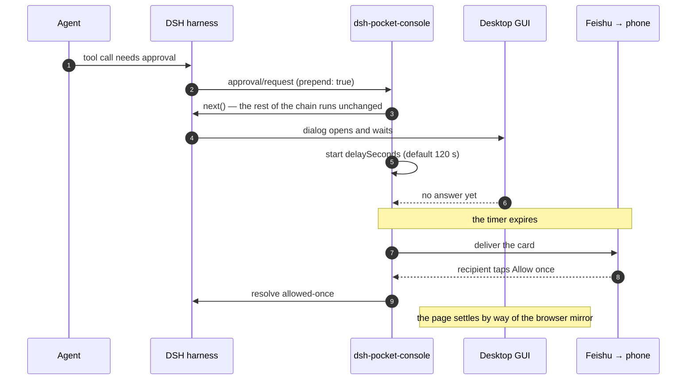

# dsh-pocket-console

**Put [DeepSeek Harness](https://github.com/deepseek-ai/deepseek-harness) in your pocket.** When you step away from the desk, `dsh-pocket-console` forwards the two moments that would otherwise stall an agent — **tool-call approvals** and **`ask_user_question` prompts** — to your phone as Feishu interactive cards, so you can approve or answer from anywhere.

[](https://www.npmjs.com/package/dsh-pocket-console)
[](https://github.com/picsky/dsh-pocket-console/actions/workflows/ci.yml)
[](LICENSE)


English · [简体中文](README.zh-CN.md)

> **Unofficial project.** Independently developed and maintained by community members — not affiliated with DeepSeek, and not reviewed or endorsed by it. Evaluate any third-party plugin before you install it.

---

## The problem

An unattended DeepSeek Harness run does not fail when it needs you — it **waits**. Neither seam has a timeout:

- A tool call that needs approval resolves only when an answerer replies, so the turn sits there.
- `ask_user_question` blocks exactly the same way.

Close the browser and walk away, and the agent is stuck until you come back. `dsh-pocket-console` is the answerer that reaches you.

## What it does

- **Desktop first.** Every request goes to the desktop GUI first. Answer there and your phone is never touched.
- **Phone as backup.** After `delaySeconds` with no desktop answer, the request goes out as a Feishu card. Tap a button and the agent continues immediately.
- **Covers both seams.** Approvals *and* questions, not just one.
- **A real DSH plugin, not a wrapper.** It ships as a `dsh.bundle` profile layer, registers on the two documented answerer waterfalls (`approval/request`, `user-questions/request`) with `prepend: true`, and contributes a Settings card on its own namespace. Nothing in DSH is patched or forked.
- **One-scan setup.** The Settings card shows a QR code. Scanning it creates the Feishu app, configures its permissions, event subscription, and callback, and records your recipient id — automatically.
- **Outbound only.** Delivery rides the Feishu WebSocket long connection, so there is no public IP, domain, port forwarding, or tunnel.
- **Channel-agnostic core.** Feishu is one transport behind a documented contract. Telegram, WeCom, DingTalk, or ntfy are a new file, not a rewrite.

<!-- Demo: record a short GIF of the Settings card → scan → approval arriving on the phone,
     save it as assets/demo.gif, then replace this comment with the line below.

     The src is an ABSOLUTE url on purpose. `assets/` is not in package.json's `files`
     (a 4 MB package does not need 3 MB of GIF), and npm re-hosts only what the tarball
     carries — so a relative `assets/…` path renders on GitHub and 404s on npmjs.com.
     The absolute url lands on both. Keep it in sync with README.zh-CN.md.

     <p align="center"></p> -->

### Why not just forward every request to my phone?

Because the interesting case is not the one where you are away — it is the one where
you are *right there*. Sending everything to the phone makes the desk worse to use; a
queue of notifications is not a decision surface, and a card that arrives while you are
looking at the dialog it describes is noise. So the desktop answers first, by default
for two minutes, and the phone is what happens when nobody does.

Three smaller choices follow from the same idea:

- **The desktop follows the phone.** Answer on the phone and the page you left open
  settles the same way a click there would — the composer closes instead of waiting for
  a decision that already happened.
- **Questions are answered as written.** `ask_user_question` takes an array and returns
  every answer at once, so the card lays all of them out with progress, multi-select,
  and a typed answer beside the options — rather than turning "answer three questions"
  into three waits on a small screen.
- **A finished run can hand you the next step.** With `resultNotify: idle`, a session
  that goes quiet sends its answer with a box to reply in, and what you type continues
  that session.

## Quick start

Install from [npm](https://www.npmjs.com/package/dsh-pocket-console). The published tarball carries its Feishu transport inside it, so the install resolves nothing that needs a build permission and runs no install-time script:

```sh
dsh plugin --profile web add dsh-pocket-console
```

A tarball from `pnpm pack` installs the same way:

```sh
dsh plugin --profile web add ./dsh-pocket-console-<version>.tgz
```

Installing straight from GitHub works too, but a git dependency resolves its own dependencies from the registry, so the transport's `protobufjs` postinstall makes pnpm ≥11 stop that first install. pnpm appends a stub to the profile's `pnpm-workspace.yaml`, and the stub is not a decision — set it to `false` and re-run:

```yaml
# $DSH_HOME/profiles/web/pnpm-workspace.yaml
allowBuilds:
  protobufjs: false
```

```sh
dsh plugin --profile web add github:picsky/dsh-pocket-console
```

Restart `dsh web`, then open **Settings → Plugins → Plugin configuration → "Pocket console"**:

1. Click **Scan to create an app**, or **Use an existing app**
2. The card immediately reports what it is doing — **Creating the Feishu app… the QR code is on its way**
3. A QR code appears in the card
4. Scan it with Feishu (or open the same link on your phone)
5. The card reports **Bound**, naming the app, the recipient, and whether the connection is up

The QR code is a round trip to Feishu, so it cannot be instant; what it must never be is invisible. The card announces the wait the moment you click, keeps it on screen while the code is on its way, and says so again if that wait turns out to be unusually long. While an attempt is running the card asks the host every 0.7 seconds instead of every 3, so the code and the verdict appear as soon as they exist.

**Which of the two?** The card says it beside the buttons: an app created through the scan has the permissions this plugin needs already configured on it, so a first run should scan. If you have scanned before — for this deployment or another one — use **Use an existing app** and enter the App ID and App Secret of the app that scan created; its permissions are already right, so nothing has to be authorized again.

**Creating** walks the official one-click flow and registers everything the plugin needs on a brand-new app.

**Using an existing app** asks for that app's **App ID and App Secret** (developer console → *Credentials & Basic Info*) and connects with them. There is no scan, no launch page, and no device-authorization wait: those two values are exactly what the channel needs, and they are stored in the credential store the same way the one-click flow stores its own. Nothing about that app is modified.

**The pair is checked before anything connects.** The channel asks `open.feishu.cn` for a tenant token with exactly the credentials it was given, and only opens the long connection when that succeeds. This is what makes a wrong App ID or App Secret visible: the platform's own reason comes back on the card ("App ID 不存在…", "App Secret 不正确…") instead of a connection that retries forever and looks like one that is merely slow. A pair the platform rejects is not kept — the next start does not retry it. If the platform cannot be reached at all, the card says that instead, and keeps what you entered.

**Connected means connected.** The card reports **Bound** only once the long connection has completed its handshake, and it keeps reporting whether the connection is up, so a dropped or reconnecting tunnel is visible rather than implied. While an attempt is running the card polls faster and says so, including a note when a handshake is taking unusually long.

The launch page's own "update an existing app" mode is deliberately not used: it needs the same secret anyway, and it adds a polling flow and a ten-minute window in exchange for nothing.

**Without any scan**, put the app's credentials in the credential store under the names `DSH_FEISHU_APP_ID` and `DSH_FEISHU_APP_SECRET` (that is what `appIdRef` and `appSecretRef` point at), and the plugin connects on its own at every start. The recipient then comes from `receiveId`, or from a direct message the bot receives.

**Who becomes the recipient.** A direct message binds an *unbound* deployment: the first person to reach the bot is taken to be its operator. It does not re-bind a *bound* one — the recipient decides where approval cards go and whose presses are honoured, and a card is a capability, so an account that can merely reach the bot must not be able to take that role. A group message never binds either, whichever scopes an adopted app carries. Once bound, changing the recipient is the Settings card's business: **Use another app**, or **Unbind** and send a new direct message.

**One Feishu app serves one DSH instance.** Long-connection events are not broadcast: Feishu delivers each event to a single connection, so two instances sharing a bot would see approvals land on whichever one happened to receive them. Use one app per instance, and `titlePrefix` to tell them apart.

The app's permissions, its long connection, and your recipient id come from the official one-click app creation flow ([OAuth 2.0 Device Authorization Grant](https://open.feishu.cn/document/mcp_open_tools/integrating-agents-with-feishu/overview)); the link is valid for 10 minutes and can be used once.

**You scan once.** The app credentials and the bound recipient live in the credential store, so every later `dsh` start reconnects the long connection on its own — no card, no click. The scan is offered again only after **Unbind**, or by pointing the card at another app with **Use another app**.

Releases are tag-driven and publish through npm trusted publishing; [docs/releasing.md](docs/releasing.md) covers the one-time npm setup and what a release verifies.

To remove it:

```sh
dsh plugin --profile web remove dsh-pocket-console
```

## How it works

DSH resolves both of these through Cordis **waterfall events**, and the Web GUI is just one answerer on each chain:

```
approval/request          ─┐
                           ├─→ dsh-pocket-console ─→ channel ─→ your phone
user-questions/request    ─┘         │
                                     └─→ next() → desktop GUI → other answerers
```

The two chains are identical apart from the outcome they carry, and the plugin never
takes a request away from the desktop — it adds a second answerer to a race and lets
whichever side answers first win. The ordering is the whole design, so it is worth
seeing once:



Three consequences fall out of that shape, and each is a decision with a record behind
it:

- **It registers with `prepend: true`.** The shipped Web forwarding listener does not call `next()` while a browser is connected, so an escalation answerer registered behind it would never run at all — [ADR 0007](docs/decisions/0007-prepend-and-race-the-desktop.md).
- **It calls `next()` first and races the timer.** The desktop chain keeps running unchanged; whichever side answers first wins. Approval semantics do not change — a grant is still one-shot (`allowed-once`).
- **A phone answer leaves the desktop composer waiting**, because the page is still holding the same request. The browser half closes it by replaying the same client call a click makes — [ADR 0002](docs/decisions/0002-desktop-mirror-runs-in-the-browser.md).

The card edits the settings above through the client **settings scope**, so each write is fenced by the revision the card read, and a save is the only thing that writes. A saved change takes effect on the **next** decision, not at the next restart: the provider hands the plugin a source once and then only reports changes, and the plugin re-reads that source on every report. Binding and status talk to the Host half over **same-origin HTTP routes** (`/__pocket/state`, `/bind`, `/unbind`, `/adopt`, `/mirror`, `/qr.svg`) rather than a Remote method: the Remote type surface is generated and the forwarded-event allowlist is host-owned, so neither is open to out-of-tree plugins. Same-origin reuses the browser's existing session and needs no token. `/state` reports the enrollment, the effective settings, and every escalation still open — with what each one is and whether the phone already has it. Both the section and the routes follow their services through `ctx.inject` rather than reading them once at load, so a deployment that composes no settings provider installs no section, one that composes no web server logs the binding link instead of serving a card, and either way the plugin still loads and both halves appear whenever the service does.

**The terminal stays quiet.** The Feishu SDK logs a startup banner, a line per connection step, and a line from its event dispatcher at info level; all of that is routed into this deployment's **debug**, so a running deployment does not read it. Its errors and warnings are routed to warn, where they belong. Turn the deployment's log level up to debug and the SDK's own account of what it is doing comes back with it. The plugin's own lines follow the deployment's `locale`, so one deployment reads one language — [ADR 0008](docs/decisions/0008-the-log-speaks-the-deployments-language.md).

## Answering questions from your phone

`ask_user_question` takes an **array** of questions and returns every answer at once. The desktop GUI walks them one at a time with a "2 / 3" counter; the phone card lays them all out at once — deliberately:

| | Desktop GUI | Phone card |
|---|---|---|
| Layout | One question at a time, with Back / Next | All questions visible, answer in any order |
| Options | A list, each with its description | One full-width button per option, descriptions in the body above |
| Typed answer | Available beside the options | Available beside the options, submitted with them |
| Answered | Gone once you page past it | **Stays in place**, shows `✅ your choice`, loses its controls |
| Submit | "Submit" appears on the last question only | Resolves automatically once every question is answered |

All-at-once suits a phone: each card rewrite is a network round trip, so a page-turning wizard turns "answer three questions" into three waits, and scrolling beats paging on a small screen. What it must not become is a card that does nothing when you tap, so **every answer rewrites the card** — the progress line advances, the answered question turns into `✅ answer`, and the rest stay live.

Question shapes:

- options, single-select → one full-width button per option, plus a typed answer for the same question
- options, multi-select → checkboxes plus an optional typed answer, submitted together
- no options → a free-text input plus a Submit button
- an option `description` renders as an **Options** legend in the body — a button label has no room for it

The desktop follows. An answer given on the phone is mirrored onto the page's own composer, through the same client call a click there makes, so the request settles and the composer clears instead of waiting for a decision that already happened. The mirror also covers approvals. It is a browser-side action because the Host cannot withdraw a forwarded request: the gateway finishes one only when a browser answers it. The browser half reports each attempt — `loaded`, `watching`, `applied`, or `skipped` with its reason — and the Host logs it and serves the last few on its state route, so a mirror that is not landing says which step it reached.

## Result notices

Approvals and questions are requests: the harness is waiting, and so is the channel. A result notice is the other direction — a session you left running stops, and its result comes to the phone.

Set `resultNotify: idle` and, after a session goes quiet, the phone receives a card carrying that turn's **answer** plus a text box. Type the next instruction there and send it: it is delivered to the same session as a new message, and the work continues with the same context. No desktop is involved, and nothing waits on the desktop, so this path cannot strand a card the way a request can.

`idle` is the default, because a result nobody hears about is the state this plugin exists to fix. Set it to `off` from the Settings card when you would rather the channel carried live requests only.

The answer is the message the Web GUI leaves unfolded — the turn's last assistant message that speaks without calling a tool. Everything else in the turn is process the GUI folds away, and a notice never carries it.

What suppresses or delays a notice:

- `resultNotify` is `idle` by default; set it to `off` to leave the channel to live requests only.
- A session that produced no answer (only tool calls) notifies nothing.
- The notice waits out `delaySeconds` of quiet, and keeps waiting while the session is still working, so a run of turns collapses into one notice.
- One session notifies at most once per `resultNotifyCooldownSeconds`.
- Delegated sessions are not reported separately; the session that asked for the subagent is.
- A session whose agent the host has already reclaimed is not resumed, and says so in the log.
- A notice stops accepting a reply the moment it stops being the session's latest word: a newer result supersedes it, or new input arrives from any surface — including input that arrived while dsh was not running, which is checked against the session's own log. There is no time limit — a notice you come back to tomorrow is still an offer, and **restarting dsh does not withdraw it**. The card is rewritten to say why it stopped, so a reply can never inject an instruction written against a superseded answer. A reply needs a running session: until the session is open again the card says the session is not running, which is a different thing from an expired result.

The instruction enters the session as **your message**, attributed the way the harness attributes human input: the surface a person is speaking through mints it, which is what dsh's own remote client does with an editor prompt (`packages/acp/acp/src/session.ts`). That attribution is also what keeps the instruction visible in the Web flow: anything else is rendered as injected context, folded into the turn's process. It therefore carries human authority too — a feature that requires human input accepts it — and the log does not distinguish it from a message typed at the desk.

## Security

An approval card is a **remote code-execution grant channel**. It is built accordingly.

- **Grants are one-shot.** `allowed-once` applies to exactly the call that asked, and nothing after it.
- **Secrets never touch the environment.** Every command the agent runs inherits the process environment and could read a secret out of it. Credentials live in `$DSH_HOME/.credentials.yaml` instead.
- **The app asks for the minimum.** It starts from the minimal preset (`addons.preset: false`, Bot capability only) and adds exactly three scopes, one event, and one callback — not the broad default template with Drive, Wiki, and Bitable access.
- **Callback payloads are validated.** Buttons carry a single-use random `rid`; an answer must name an option that question actually offered, and the `rid` dies the moment the request settles.
- **Only the bound recipient can press.** A card is a capability — whoever holds the message can press its buttons — so an action is honored only when the operator's `open_id` is the bound recipient. An answer from the phone becomes human-attributed input, which is exactly why that check is not optional.
- **The recipient itself is not up for grabs.** Binding is what decides where cards go and whose presses count, so a direct message binds an unbound deployment and nothing more: a message from any other account, and any group message, is refused and logged. Taking the recipient over would hand the whole approval channel to whoever could reach the bot.
- **Every route is behind the connection's trust fence.** `/__pocket` carries the binding, the open requests, and the mirror decision, so a request is answered only when the connection accepts it (the same fence the `/api` surface uses); an untrusted caller gets its `401`/`403` before anything is read. A deployment without a connection falls back to the `Origin` check on every mutating call, which refuses cross-site writes with `403`.
- **Outbound only.** The long connection needs no inbound port, no public IP, and no tunnel.
- **Installing runs nothing.** The tarball ships its transport bundled rather than resolved, so a profile installs no dependency that declares an install script and executes none of them; the bundled code is the official SDK, exactly as it was published.

Found something? [SECURITY.md](SECURITY.md) says how to report it privately, what is in scope, and which invariants above are claims you can hold the code to.

## Writing another channel

The core owns four things: the two answerer seams, the escalation timer, the pending registry, and decision decoding. **Everything about how a message travels and how a button comes back belongs to the channel.**

A channel is one ESM file exporting `create({ ctx, config, binding, log })` and returning a small object — `available`, `supportsForms`, `deliver`, `update`, `subscribe`, `close`, plus optional `enrollmentState` / `beginEnrollment` / `clearEnrollment` for scan-style onboarding.

See [`providers/README.md`](providers/README.md) for the full contract. Candidate transports:

| Channel | Outbound only | Can answer | Notes |
|---|---|---|---|
| Telegram Bot | ✅ long poll | ✅ inline keyboard | `deliver` sends, `subscribe` polls |
| WeCom / DingTalk | ✅ long connection | ✅ interactive cards | Structurally identical to the Feishu channel |
| ntfy | needs client reachability | ✅ action buttons | Buttons call a small route on the host |
| Bark / ServerChan | ✅ | ❌ push only | `supportsForms: false`, notification only |

## Limitations

- **A phone answer needs an open desktop page to be mirrored there.** The browser half reads the pending interaction the page already has and applies the phone's answer to it, so the composer settles exactly as a click would. With no page open there is nothing to mirror — the answer still reaches the model, and the transcript shows it — but a page reloaded later never replays it, because a mirror is only honoured for a minute.
- **Card text is bounded in bytes**, not characters: a card message may not exceed Feishu's 30 KB body limit, and a Chinese character costs three bytes, so the plugin keeps text under 9 KB (about 3000 characters) and says when it clipped. A `plan-review` plan longer than that arrives as its head, with the decision buttons still usable.
- **A result notice does not revive a reclaimed session.** If the host has already let the agent go, the notice is skipped and logged instead of resuming the session.
- **Long connections are limited to 50 per app and are not broadcast** — do not run several DSH instances against one Feishu app.
- **The browser half has no build step**, so it is hand-written in the client module system's factory format and renders with plain React elements rather than the shared UI component library.
- **The published package is about 4 MB**, because it carries its Feishu transport — and that transport's own dependencies — inside the tarball. That is what keeps an install free of build permissions; nothing is compiled on the machine that installs it.
- **Verified against a live Feishu tenant, but not yet at this release.** The one-scan app creation, the long connection, card delivery, and card actions arriving back all work against a real app. The credential check's both branches were observed there too — a pair the platform refuses (`code: 10014, msg: app id not exists`) and a real pair whose check is accepted, whose long connection becomes ready, and which reports `bound` with its stored recipient (see [ADR 0005](docs/decisions/0005-connected-means-connected.md)). The card-action field path, the one-option-per-row layout, and typed answers shipped after that pass: the suite covers them, and a phone still has to confirm them.

## Development

Plain ESM JavaScript, **no build step**, and a suite that needs no install:

```sh
npm test
```

One command, no credentials, no network. The install, the tests, the
real-composition check, and how to debug against a live deployment are in
[docs/development.md](docs/development.md).

## Learn more

**→ [docs/](docs/)** routes you by job: change a setting, fix something, work on the code,
cut a release, write a transport, or read why the plugin is shaped the way it is. It also
says which pages have a Chinese counterpart.

Three are worth naming here because they are not reference material:

- **[SECURITY.md](SECURITY.md)** — the invariants this plugin asserts, what is out of scope,
  and how to report a hole in one. This plugin is a remote authorization channel, so that
  list is a claim you can hold the code to.
- **[CHANGELOG.md](CHANGELOG.md)** — what each release carried. Worth reading before an
  upgrade.
- **[CONTRIBUTING.md](CONTRIBUTING.md)** — what a change needs before it lands.

## License

[MIT](LICENSE)
