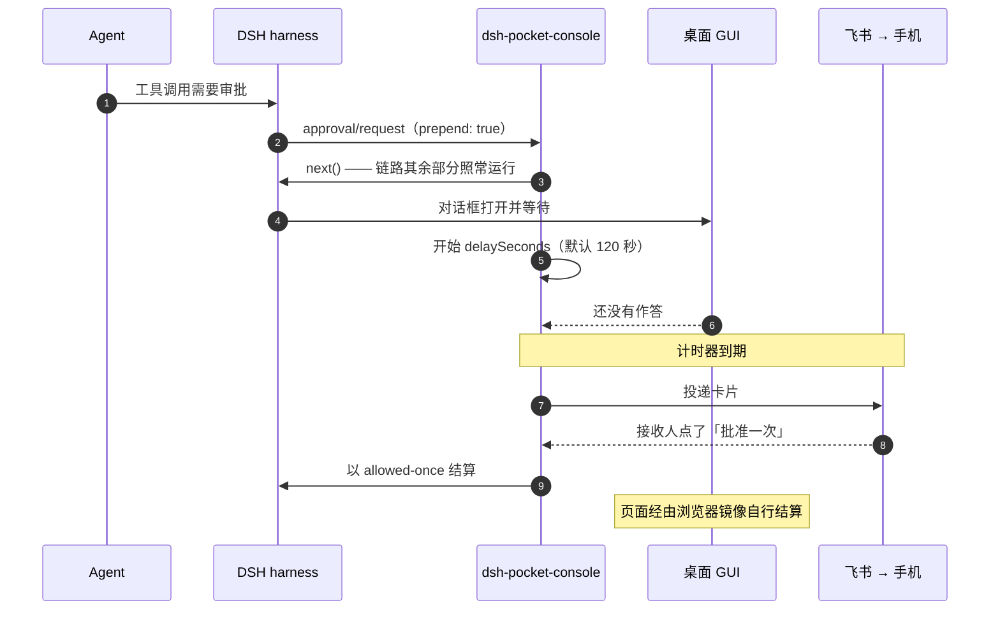

# dsh-pocket-console

**把 [DeepSeek Harness](https://github.com/deepseek-ai/deepseek-harness) 装进你的口袋。** 当你离开电脑，`dsh-pocket-console` 会把两个**会让 Agent 卡住**的时刻——**工具调用审批**和 **`ask_user_question` 提问**——以飞书交互卡片的形式送到手机上，随时随地批准或作答。

[](https://www.npmjs.com/package/dsh-pocket-console)
[](https://github.com/picsky/dsh-pocket-console/actions/workflows/ci.yml)
[](LICENSE)


[English](README.md) · 简体中文

> **非官方项目。** 由社区成员独立开发和维护，与 DeepSeek 无隶属关系，也未经过其审核或推荐。安装任何第三方插件前请自行甄别。

> **关于语言**：`README.md` 与本文是双语的入口文档。`docs/` 下的参考页（配置、故障排查、
> 开发、架构决策）以及 `SECURITY.md`、`CHANGELOG.md`、`CONTRIBUTING.md`、`providers/README.md`
> 目前只有英文——源码、提交信息与 issue 也一律用英文，这样维护上只有一份要同步。
> 需要哪一页中文，开个 issue 说一声即可。

---

## 要解决的问题

无人值守的 DeepSeek Harness 在需要你的时候**不会失败，而是等待**。两条 seam 都没有超时：

- 需要审批的工具调用，只有在 answerer 给出结论后才 resolve，这一轮就停在那里。
- `ask_user_question` 以完全相同的方式阻塞。

关上浏览器走开，Agent 就一直卡到你回来。`dsh-pocket-console` 就是那个能找到你的 answerer。

## 它能做什么

- **桌面优先**：请求先给桌面 GUI。在桌面上答了，手机完全不会被骚扰。
- **手机兜底**：`delaySeconds` 秒内桌面没应答，才发飞书卡片。点一下按钮，Agent 立刻继续。
- **两条 seam 都覆盖**：审批和提问，不是只做一半。
- **是真正的 DSH 插件，不是外壳**：以 `dsh.bundle` profile 层分发，在两条有文档的 answerer waterfall（`approval/request`、`user-questions/request`）上以 `prepend: true` 注册，并以自己的命名空间贡献一张设置卡片。没有 patch 或 fork DSH 的任何代码。
- **扫码即装**：设置卡片上出现二维码，扫码后飞书应用、权限、事件订阅、回调、以及你的接收人 id **全部自动配置完成**。
- **只需出网**：走飞书 WebSocket 长连接，不需要公网 IP、域名、端口转发或内网穿透。
- **核心与通道解耦**：飞书只是一个按契约实现的传输。接 Telegram、企业微信、钉钉或 ntfy 是**新增一个文件，不是重写**。

<!-- 演示：录一段 GIF（设置卡片 → 扫码 → 手机收到审批），存为 assets/demo.gif，
     然后把这段注释替换为下面这一行。

     src 用**绝对地址**是有意的：`assets/` 不在 package.json 的 `files` 里
     （4 MB 的包不该带 3 MB 的 GIF），而 npm 只重新托管 tarball 里有的文件——
     所以相对路径 `assets/…` 在 GitHub 上能显示，在 npmjs.com 上会 404。
     绝对地址两边都能显示。请与 README.md 保持同步。

     <p align="center"></p> -->

### 为什么不干脆把所有请求都推到手机？

因为真正有意义的场景不是"你不在"，而是"**你就在那儿**"。把所有东西都推到手机上会让桌面变得更难用：
一串通知不是决策界面，而一张卡片在你正盯着它描述的那个对话框时弹出来，只是噪音。
所以桌面先答——默认给它两分钟——手机是"没人答"之后才发生的事。

同一条思路还带出三个小决定：

- **桌面会跟着手机走。** 在手机上作答后，你留着没关的页面会用和"在桌面上点一下"完全相同的方式结算，
  面板关掉，而不是继续等一个已经做过的决定。
- **提问按原本的形态作答。** `ask_user_question` 收的是一组问题、一次性返回全部答案，
  所以卡片把题目全部铺开，带进度、多选，以及选项旁边的输入框——而不是把"回答三个问题"
  在小屏幕上变成三次等待。
- **跑完的一轮可以顺手把下一步交给你。** 打开 `resultNotify: idle`，会话安静下来后会把结果连同一个
  输入框发给你，你写的内容会接着这个会话继续跑。

## 快速开始

从 [npm](https://www.npmjs.com/package/dsh-pocket-console) 安装。发布的 tarball 已经把飞书通道内置其中，所以安装过程不会解析出任何需要构建许可的依赖，也不会执行任何安装期脚本：

```sh
dsh plugin --profile web add dsh-pocket-console
```

`pnpm pack` 产出的 tarball 装法相同：

```sh
dsh plugin --profile web add ./dsh-pocket-console-<version>.tgz
```

直接从 GitHub 安装也可以，但 git 依赖会从 registry 解析它自己的依赖，于是通道带进来的
`protobufjs` 的 postinstall 会让 pnpm ≥11 中止首次安装。pnpm 会往 profile 的
`pnpm-workspace.yaml` 追加一条占位项，那不是决定——把它设为 `false`，再重新执行：

```yaml
# $DSH_HOME/profiles/web/pnpm-workspace.yaml
allowBuilds:
  protobufjs: false
```

```sh
dsh plugin --profile web add github:picsky/dsh-pocket-console
```

重启 `dsh web`，打开 **设置 → 插件 → 插件配置 →「Pocket console」**：

1. 点「扫码创建应用」，或「使用已有的应用」
2. 卡片**立刻**报出它在做什么：「正在创建飞书应用…二维码马上出现」
3. 卡片上出现二维码
4. 用飞书扫码（或在手机上打开同一链接）
5. 卡片报「已绑定」，并列出**应用**、**接收人**、以及**长连接是否已建立**

二维码要一次网络往返才拿得回来，做不到"点完就有"；但**绝不能点完没反应**。
卡片在你点下的那一刻就报出正在等待，二维码在路上时一直显示，
等得异常久时还会再说明一次。尝试期间卡片每 **0.7 秒**问一次宿主（平时 3 秒），
所以二维码和结论一就绪就会出现在卡片上。

**两条路怎么选？** 卡片就在按钮下面写着：扫码创建出来的应用**已经带好本插件需要的权限**，
所以第一次用应该扫码。如果你之前扫过码（这个部署或别的部署），就点「使用已有的应用」，
填**那次扫码创建的应用**的 App ID 与 App Secret——权限本来就是对的，不需要再授权一次。

**扫码创建**走官方的一键流程，在一个全新应用上把插件需要的东西全部注册好。

**使用已有的应用**会向你要那个应用的 **App ID 与 App Secret**（飞书开发者后台 →「凭证与基础信息」），
插件直接用它们连接。**不扫码、不开启动页、不等设备授权**：这两项本来就是通道连接所需要的东西，
它们会被存进凭据库——和一键创建流程存放自己凭据的地方完全一样。那个应用的其它配置不会被改动。

**连接之前先校验凭据。** 通道会拿这两项去 `open.feishu.cn` 换一次 tenant token，**通过之后才**建立长连接。
这正是让 App ID / App Secret 填错能被看见的原因：平台给出的原因会直接显示在卡片上
（「App ID 不存在…」「App Secret 不正确…」），而不是一条一直重试、看起来只是"有点慢"的连接。
平台判定为无效的那组凭据**不会被保留**，下次启动不会拿它再试一遍。
如果根本连不上开放平台，卡片会照实这么说，并且**保留**你填的内容。

**连上了就是连上了。** 只有长连接握手完成，卡片才会显示「已绑定」；并且它会持续报告连接是否在线，
断线重连、连接失败都看得见。正在连接的这段时间卡片会加快轮询并说明状态，握手异常久时也会提示。

启动页自带的"更新已有应用"模式**刻意不用**：它同样需要 secret，却额外引入一条轮询链路和 10 分钟窗口，
换不来任何东西。

**完全不扫码**也可以：把应用的凭据放进凭据库，键名就是 `DSH_FEISHU_APP_ID` 与 `DSH_FEISHU_APP_SECRET`
（即 `appIdRef` / `appSecretRef` 指向的名字），插件每次启动都会自己连上。接收人则来自 `receiveId`，
或者 bot 收到的一条私聊消息。

**谁能成为接收人。** 私聊只会绑定**尚未绑定**的部署：第一个联系到这个 bot 的人被视为它的操作者。
它**不会**改绑一个**已经绑定**的部署——接收人决定了审批卡片发去哪里、谁的点击算数，
而卡片本身就是一张凭证，所以仅仅是"能联系到这个 bot"的账号不该能顶替这个角色。
群消息同样永不绑定，无论被采用的应用带了哪些权限。
一旦绑定，改接收人是设置卡片的事：用「使用其他应用」，或者先「解除绑定」再发一条新的私聊。

**一个飞书应用只服务一个 DSH 实例。** 长连接的事件**不广播**：飞书把每个事件只投递给其中一条连接，
所以两个实例共用一个 bot 时，审批会随机落到某一侧。请一个实例一个应用，并用 `titlePrefix` 区分。

飞书应用、权限、长连接、接收人 id 都来自飞书官方的**一键创建应用**
（[OAuth 2.0 Device Authorization Grant](https://open.feishu.cn/document/mcp_open_tools/integrating-agents-with-feishu/overview)），
链接 **10 分钟内有效、仅可使用一次**。

**只扫这一次。** 应用凭据与接收人都存在凭据库里，之后每次启动 `dsh` 都会自己把长连接接回来——
不用进设置、不用点按钮。只有在你点过「解绑」，或者点「使用其他应用」把卡片指向另一个应用时，才会再出现扫码。

卸载：

```sh
dsh plugin --profile web remove dsh-pocket-console
```

## 工作原理

DSH 通过 Cordis **waterfall 事件**解析这两件事，而 Web GUI 只是每条链上的一个 answerer：

```
approval/request          ─┐
                           ├─→ dsh-pocket-console ─→ 通道 ─→ 你的手机
user-questions/request    ─┘         │
                                     └─→ next() → 桌面 GUI → 其它 answerer
```

两条链除承载的结果不同之外完全一致，而且插件**从不把请求从桌面手里拿走**——
它只是往一场竞速里多放一个 answerer，谁先答谁生效。**顺序本身就是全部设计**，值得看一眼：



从这个形状里掉出三个结论，每一个背后都有一条决策记录：

- **以 `prepend: true` 注册。** DSH 自带的 Web 转发器在浏览器连着时不调用 `next()`，
  所以排在它后面的升级器**永远不会执行**——见 [ADR 0007](docs/decisions/0007-prepend-and-race-the-desktop.md)。
- **先 `next()` 再和计时器竞速。** 桌面链路照常跑；谁先答谁生效。审批语义完全不变——授权仍然是一次性的（`allowed-once`）。
- **手机上答完，桌面面板还在等**，因为页面仍然握着同一条请求。浏览器半边会用"在桌面上点一下"
  完全相同的那次客户端调用把它关掉——见 [ADR 0002](docs/decisions/0002-desktop-mirror-runs-in-the-browser.md)。

浏览器卡片通过客户端的**设置作用域**（settings scope）修改上面这些设置：每次写入都以它读到的
revision 为栅栏，只有点「保存」才真正落盘。**保存后在下一次决策就生效，不需要重启**：
provider 只把取值来源交给插件一次，之后只通知"变了"，插件在每次通知时**重新读那个来源**。
绑定与状态则走**同源 HTTP 路由**
（`/__pocket/state`、`/bind`、`/unbind`、`/adopt`、`/mirror`、`/qr.svg`），而不是 Remote 方法：Remote 的类型面是生成的、
转发事件白名单由 Host 拥有，**外部插件两者都插不进去**；同源路由天然复用浏览器已有会话，不需要 token。
`/state` 回报绑定状态、生效中的设置，以及**当前所有未结算的升级请求**——每一个是什么、是否已经送到手机。
设置分区与路由都通过 `ctx.inject` **跟随服务**，而不是在加载时读一次快照：所以没有设置 provider 的部署
不装分区、没有 webServer 的部署改为把绑定链接打进日志而不是提供卡片，两种情况下插件都照常加载，
服务一旦出现，对应的一半就会出现。

**终端保持安静。** 飞书 SDK 会在 info 级别打印启动横幅、每条连接步骤、以及事件分发器的就绪行；
这些一律被接到本部署日志的 **debug**，正常运行不会看到。它的错误与警告仍然走 warn。
把部署日志级别调到 debug，SDK 自己的过程记述就随之一并回来。

## 提问在手机上怎么显示

`ask_user_question` 一次可以问**多个问题**（`questions` 是数组），答案一次性回给模型。
桌面 GUI 是逐题翻页、带 "2 / 3" 计数；手机卡片一次全列——这是有意的：

| | 桌面 GUI | 手机卡片 |
|---|---|---|
| 布局 | 一次一题，带上一题 / 下一题 | 全部可见，可任意顺序作答 |
| 选项 | 列表，每项带说明 | 每个选项独占整行按钮，说明以图例放在正文 |
| 自由输入 | 选项旁边始终可用 | 选项旁边始终可用，且与选项同一次提交 |
| 已答 | 翻页离开后看不到 | **原地保留**，显示 `✅ 你的选择`，移除该题控件 |
| 提交 | 只有最后一题才出现「提交」 | 全部答完**自动** resolve |

一屏全列更适合手机：飞书每次改写卡片都是一次网络往返，翻页式向导会把"答三题"变成三次等待，
而小屏上滚动本来就比翻页自然。但它绝不能变成一个"点了没反应"的卡片，
所以**每答一题都会改写卡片**：进度行前进、已答题目变成 `✅ 答案`、其余保持可点。

各题形态：

- 有选项、单选 → 每个选项一个整行按钮，同题另附「提交其他回答」自由文本
- 有选项、多选 → 勾选组件 + 可选的「补充说明」，一次提交一起回传
- 没有选项 → 自由文本输入框 + 「提交本题」
- 选项带 `description` 时，说明以正文里的「选项」图例呈现——按钮标签放不下它

桌面端会跟着走。手机上给出的答案会被镜像到本页自己的面板上，走的是和"在桌面上点一下"完全相同的那次客户端调用，
于是请求结算、面板消失，而不是继续等一个已经做过的决定。审批也走同一套镜像。
之所以由浏览器这侧动手，是因为 Host 撤不掉一条已经转发出去的请求：gateway 只在浏览器回包时才结束它。
浏览器半边会把每次尝试回报给 Host——`loaded`、`watching`、`applied`，或带着原因的 `skipped`——
Host 记录进日志，并把最近几条挂在 state 路由上；镜像没生效时，它能说明卡在哪一步。

## 结果通知

审批和提问都是请求：harness 在等，通道也在等。结果通知是反方向——你放着不管的会话停下来了，结果主动发到手机上。

把 `resultNotify` 设成 `idle`：会话安静下来后，手机会收到一张卡片，上面是这一轮的**结果**，外加一个输入框。
在那里写下一条指令发出去，它就会作为新消息进入同一个会话，带着原来的上下文继续干活。
全程不经过桌面，也不等桌面，所以不会像请求那样把卡片晾在那里。

结果就是 Web GUI 不折叠的那条消息——本轮最后一条"说了话、但没有调用工具"的 assistant 消息。
这一轮里其它内容都是 GUI 折叠掉的过程，通知里不带。

以下情况不会通知或会延后：

- `resultNotify` 默认是 `idle`；设成 `off` 就只保留实时请求，不再推送结果。
- 没有产出结果（只调了工具）的会话不通知。
- 通知要等 `delaySeconds` 的安静时间；会话还在干活就继续等，所以连续多轮只会合并成一条通知。
- 同一个会话两次通知之间至少间隔 `resultNotifyCooldownSeconds`。
- 子会话单独不通知，由发起它的那个会话通知。
- 已经被宿主回收的会话不会为此被唤醒，日志里会写明。
- 通知一旦不再是该会话的最新消息就停止接受回复：被更新的结果取代，或者会话有了新输入（来自任何界面）。**没有时间限制**——你第二天回来回复它，它仍然有效。
  卡片会被改写成对应说明，所以回复永远不会把"针对旧结果的指令"塞进已经走远的会话。

指令会作为**你自己的消息**进入会话，归属方式和 harness 处理人类输入一致：由人正在使用的那个界面来签发。
dsh 自己的远端客户端（编辑器里的 prompt）就是这么做的（`packages/acp/acp/src/session.ts`）。
也正是这个归属决定了它在 Web 上**可见**——其它归属会渲染成"注入的上下文"，被折进那一轮的过程里。
因此它同时带有完整的人类授权（需要人类输入的功能会接受它）；日志里它与你在桌面输入的消息无法区分。

## 安全

审批卡片本质上是一条**远程代码执行授权通道**，因此按这个标准来做：

- **授权一次性。** `allowed-once` 只对该次调用生效，之后什么都不算。
- **密钥不进环境变量。** Agent 执行的每条命令都继承进程环境，能直接把密钥读出来。
  凭据统一放 `$DSH_HOME/.credentials.yaml`。
- **应用只申请必要权限。** 从最小基座起步（`addons.preset: false`，仅机器人能力），
  只加三个权限、一个事件、一个回调——而不是默认模板那一大堆云文档 / 知识库 / 多维表格权限。
- **回填严格校验。** 按钮只带一次性随机 `rid`；答案必须来自该问题真正提供过的选项，
  请求结算后 `rid` 立即失效。
- **只有绑定的接收人能按。** 卡片本身就是一张凭证——拿到消息的人都能按它的按钮——
  所以只有操作者 `open_id` 等于绑定接收人时才受理。手机上给出的答案会变成人类归属的输入，
  这正是这个校验不可省的原因。
- **接收人本身也不容顶替。** 绑定关系决定了卡片发去哪里、谁的点击算数，所以私聊只绑定未绑定的部署，
  除此之外一概拒绝并记日志：来自其他账号的私聊、以及任何群消息。顶替接收人就等于把整条审批通道
  交给"能联系到这个 bot 的任何人"。
- **所有路由都在连接的信任围栏之后。** `/__pocket` 承载绑定、未结算请求与镜像决定，
  所以只有连接认可这次请求时才会作答（与 `/api` 面同一道围栏）；不可信的调用在任何内容被读取前
  就拿到它的 `401`/`403`。没有 connection 服务的部署退回每次变更调用都做的 `Origin` 校验，
  跨站写入一律 `403`。
- **只需出网。** 长连接不需要监听端口、公网 IP 或隧道。
- **安装不执行任何代码。** tarball 把通道内置发布，而不是让安装过程去解析它，
  所以 profile 不会安装任何声明了安装脚本的依赖，更不会执行它们；
  内置的就是官方 SDK 原样发布的代码。

发现了问题？[SECURITY.md](SECURITY.md) 写明怎么私下上报、哪些在范围内，
以及上面这些不变式里哪些是你**可以拿来要求代码**的断言。

## 写一个新通道

核心只做四件事：两条 answerer seam、升级计时、待决注册表、决策解码。
**消息怎么送达、按钮怎么点回来，全归通道。**

一个通道就是一个 ESM 文件，导出 `create({ ctx, config, binding, log })`，
返回一个小对象——`available`、`supportsForms`、`deliver`、`update`、`subscribe`、`close`，
再加上扫码式上手可选的 `enrollmentState` / `beginEnrollment` / `clearEnrollment`。

完整契约见 [`providers/README.md`](providers/README.md)。候选通道：

| 通道 | 只需出网 | 能否回传 | 备注 |
|---|---|---|---|
| Telegram Bot | ✅ 长轮询 | ✅ 内联键盘 | `deliver` 发消息，`subscribe` 拉回调 |
| 企业微信 / 钉钉 | ✅ 长连接 | ✅ 交互卡片 | 与飞书通道结构同构 |
| ntfy | 需手机可达 | ✅ action 按钮 | 按钮回调 Host 上的小路由 |
| Bark / Server酱 | ✅ | ❌ 只推不收 | `supportsForms: false`，仅通知 |

## 已知限制

- **要在桌面上同步，桌面上得开着这个页面。** 浏览器半边读取本页已有的待处理交互，把手机的答案
  按"点击"的同一路径应用上去，于是面板和点桌面一样结算。没有开页面就没得同步——答案照样到模型、
  会话记录里也有——但事后重新打开的页面不会重放它：镜像只在一分钟内有效。
- **卡片文本按字节限额**，不是字符数：飞书卡片消息的请求体上限是 30 KB，而一个汉字占 3 字节，所以插件把文本限制在 9 KB（约 3000 汉字）以内，并在截断时明确说明。超长的 `plan-review` 计划会以开头部分送达，决策按钮照常可用。
- **结果通知不会唤醒已被回收的会话。** 如果宿主已经把 agent 放掉，这条通知会被跳过并写进日志，而不是恢复会话。
- **长连接每应用最多 50 个，且不广播**——同一个飞书应用不要同时跑多个 DSH 实例。
- **浏览器半没有构建步骤**，所以是手写的客户端模块工厂格式，用基础 React 元素渲染，
  没有使用共享 UI 组件库。
- **发布出来的包约 4 MB**，因为它把飞书通道连同该通道自己的依赖一起装进了 tarball。
  这正是安装不需要任何构建许可的原因；安装它的机器上不会编译任何东西。
- **已在真实飞书租户上验证过，但尚未覆盖本版本。** 一键创建应用、长连接、卡片投递、
  以及卡片回调回到 Host，都在真实应用上跑通过了。凭据校验的**两条分支**也都在真实平台上观察过——
  既包括被平台拒绝的一组（`code: 10014, msg: app id not exists`），也包括一组真实凭据：
  校验通过 → 长连接就绪 → 带着已存储的接收人报 `bound`（见
  [ADR 0005](docs/decisions/0005-connected-means-connected.md)）。
  卡片回调的字段路径、选项整行、以及自由文本回答是在那次验证**之后**才改的：
  测试覆盖了它们，但仍需真机确认一次。

## 开发

纯 ESM JavaScript，**没有构建步骤**，测试也不需要先安装：

```sh
npm test
```

一条命令，不需要凭据，不需要网络。安装、测试、真实装配检查，以及怎么对着运行中的部署调试，
都在 [docs/development.md](docs/development.md)（英文）。

## 延伸阅读

| 文档 | 内容 |
|---|---|
| [docs/zh-CN/configuration.md](docs/zh-CN/configuration.md) | 每一项配置、默认值，以及哪些能在设置卡片里运行时修改 |
| [docs/zh-CN/troubleshooting.md](docs/zh-CN/troubleshooting.md) | 安装、绑定，以及卡片收不到的情况 |
| [docs/development.md](docs/development.md) | 测试套件、真实装配检查、对着运行中的部署调试 |
| [docs/decisions/](docs/decisions/) | 插件为什么长成这样，一个决定一篇记录 |
| [SECURITY.md](SECURITY.md) | 本插件声明的安全不变式，以及如何上报其中的漏洞 |
| [CHANGELOG.md](CHANGELOG.md) | 每个版本改了什么 |
| [CONTRIBUTING.md](CONTRIBUTING.md) | 一个改动落地前需要满足什么 |
| [providers/README.md](providers/README.md) | 通道契约，写给飞书之外的传输 |

## 许可

[MIT](LICENSE)
