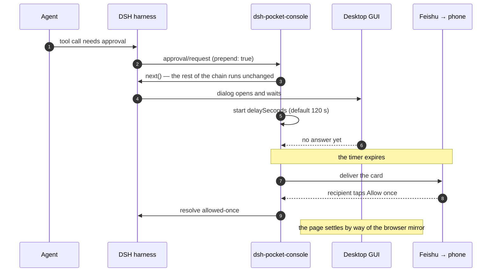
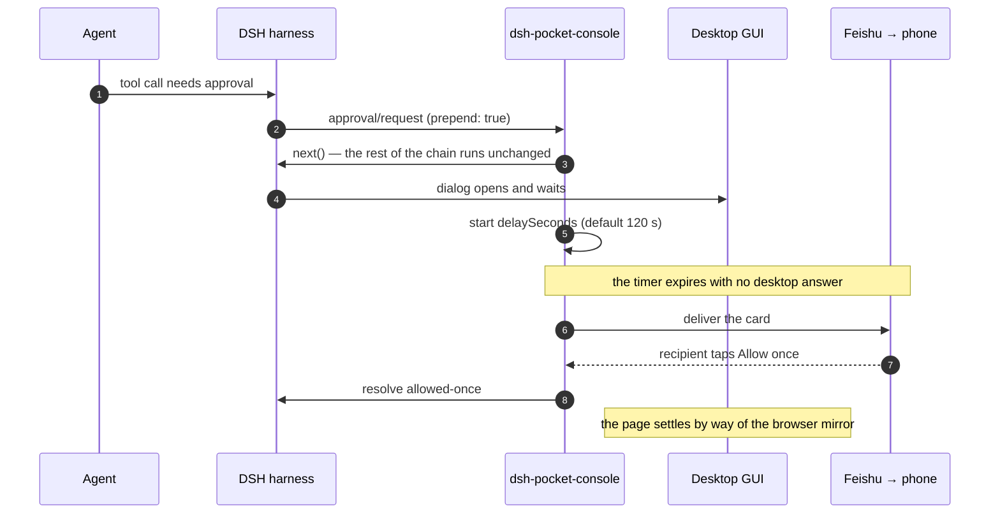

# README visual assets

What goes in this folder, in what order, and how each one is captured. The root
README has one insertion point today — the commented block under
[What it does](../README.md#what-it-does) — and this file is what decides what
fills it.

The rule this whole file follows: **an image has to answer a question the prose
cannot answer faster.** A screenshot of a settings panel answers "what do I have
to configure". A GIF answers "what actually happens when I walk away". Neither
answers the other, and a third one of the same panel answers nothing.

## 1. The distribution: 3 stills + 1 GIF

| # | Asset | The question it answers | Where it goes |
|---|---|---|---|
| 1 | `hero-pairing.svg` / `hero-pairing.png` | "What is this, in one look?" — the same request on the page and on the phone | Under the title, above **The problem** |
| 2 | `demo.gif` | "Show me the whole loop once" — bind → walk away → approve on the phone → the page settles | The existing commented block under **What it does** |
| 3 | `phone-approval.svg`, `phone-question.svg`, `phone-result.svg` | "What exactly arrives on my phone?" — the three card shapes | **Answering questions from your phone** and **Result notices** |
| 4 | `settings-card.svg` + host messages | "How much work is setup?" — the panel, the QR, the terminal line | **Quick start**, step 1 |
| 5 | a mermaid block (§7) | "Where does this sit in DSH?" — desktop-first, then the timer | **How it works** — shipped |

`demo-storyboard.svg` is the printed board for §3, not a README asset.

Order matters more than count. #1 buys the reader's next ten seconds; #2 buys the
next minute. If only one thing gets made, make #1. If only two, add #2.

**What not to do:** six screenshots stacked in a grid. The panel is already
described in prose and a table; a picture of the same panel a fourth time is
decoration, and decoration is what makes a README long and unreadable.

## 2. The hero: one image, the whole thesis

The product's entire argument is a **pairing**: the same request exists on the
page and on the phone, and the desktop is the one you are supposed to use. So the
hero is not a screenshot of a feature. It is two surfaces, one request, one arrow.

```
┌─────────────────────────────┐        ┌──────────────┐
│  DSH Web GUI — the page     │        │  Feishu      │
│                             │        │  on a phone  │
│  ┌───────────────────────┐  │  ───▶  │ ┌──────────┐ │
│  │ Allow once  │ Reject  │  │ 120s   │ │ 批准一次 │ │
│  └───────────────────────┘  │  no    │ │ 拒绝     │ │
│  approval dialog, waiting   │  answer│ └──────────┘ │
└─────────────────────────────┘        └──────────────┘
   answer here and the phone            only reached when
   is never touched                     the desk stayed quiet
```

The arrow's label is the whole design: **"desktop first · phone after 120 s"**.
Without that label the image reads like "we spam your phone", which is the exact
misreading the **Why not just forward every request to my phone?** section exists
to correct.

`hero-pairing.svg` in this folder is that layout, drawn with the real copy from
`messages.js` / `client.js`. Rebuild it from real screenshots once they exist —
the SVG is a stand-in and a crop guide, not the final asset.

## 3. The GIF: the loop, in ≤ 10 seconds

Prefer three of these over one long one. GitHub autoplays GIFs, so a long one is
paid for by every reader on every visit, forever.

**The shot list below is the summary. [`demo-storyboard.md`](demo-storyboard.md)
is the frame-by-frame sheet** — exact frame ranges, crops, cursor actions, the
ffmpeg palette commands and the pre-publish checklist. Record from that file, not
from this table.

| t | Shot | What is on screen | Caption (burned in) |
|---|---|---|---|
| 0.0–0.8 | S1 | Settings card, cursor resting on **Scan to create an app** | `1 · scan once` |
| 0.8–2.3 | S2 | Click → **Creating the Feishu app… the QR code is on its way** | the app, its scopes and the recipient are configured for you |
| 2.3–3.8 | S3 | The QR appears. Hold. **Obscure the QR** | valid for 10 minutes, single use |
| 3.9–6.9 | S4 | Cut to the phone: the card arrives, tap **批准一次** | `2 · desktop first, phone after 120 s` |
| 7.0–9.7 | S5 | Cut back to the page: the panel settles on its own, cursor still | the page follows the phone |

Totals: 194 frames at 20 fps = 9.7 s. Roughly ten seconds is the ceiling — past
that, the GIF costs more attention than the prose it replaces.

Rules for the recording:

- **Hard cuts, no crossfades.** A transition costs frames and reads as padding.
- **Cursor visible, but no cursor wander.** Move once, click once.
- **Nothing waits for a network round trip on camera.** The Feishu QR round trip
  can take seconds; record it, then cut the dead middle out. The card's own
  "still waiting" state is a feature — if you want to show it, show it as a
  still, not as four seconds of a spinner.
- **Keep every frame below the 30 KB card budget's visual cousin:** if the card
  body would have been clipped in reality, do not show it unclipped in the GIF.
- **Captions, not narration.** Five short lines total, one per shot, burned in with
  ScreenToGif or ShareX at the same y position in every shot. A GIF has no audio
  and a README has no player, so the caption is the only commentary there is.

If a still tells the story better than the loop, use the still. Three perfect
stills beat one muddy GIF.

## 4. Capture setup

| | Desktop | Phone |
|---|---|---|
| Resolution | 1920 × 1080 or 2560 × 1440, at 100 % browser zoom | default |
| Theme | whatever `dsh web` runs; keep it consistent across every shot | Feishu light theme |
| Window | one browser window, one tab, sized and never resized between shots | the app, no notification shade |
| Region | crop to the card / dialog, **not** the whole desktop | crop to the card, phone chrome optional but consistent |
| Scale | export at 2× then downscale to 1200–1440 px wide | export at 2×, downscale to 800–900 px wide |
| Format | PNG, or SVG for a diagram | PNG / WebP |
| Budget | ≤ 400 KB per still | ≤ 400 KB per still, GIF ≤ 3 MB, hero GIF ≤ 5 MB |

Recording tools that work on Windows, in order of preference:

- **ScreenToGif** — region capture, per-frame editing, and *frame de-duplication*,
  which is the difference between a 3 MB GIF and a 20 MB one. Free, portable.
- **ShareX** — region capture to GIF **or MP4** with annotation. Use it when the
  asset is a video rather than a GIF.
- **ffmpeg** — `mp4 → webp` is the quality-per-byte winner if GitHub's rendering
  is acceptable to you; `mp4 → gif` with a generated palette is the safe fallback.
- **OBS** — only for the phone, or when you need both surfaces at once.

A single recording session, one pass per asset, same window size and theme. Do
not assemble shots from separate sessions: the chrome, the fonts and the DPI will
not match, and the mismatch is what makes a README look assembled rather than
made.

## 5. Privacy, before anything is published

This plugin's whole subject matter is credentials and grants, so the screenshots
are a leak surface. Every one of these is a real story from a real repo:

- **The QR code is a live capability.** It carries the pair `client_id` /
  `client_secret` and is single-use for ten minutes. Blur or cover it in every
  frame, including frames you plan to cut — a cut frame is still in the file.
- **Cover the recipient `open_id`.** It is the identity a card action is
  authorized against. `ou_…` in a screenshot is a permanent, public identifier.
- **Never show a real App Secret.** Even partially. Use a demo tenant and a
  placeholder that is obviously a placeholder (`cli_demo0000000000`).
- **Cover the shell, the path and the hostname.** `/home/<you>/`, `$DSH_HOME`,
  internal hostnames and the browser's URL bar all say more than the screenshot
  needs to.
- **Do not screenshot a real conversation.** Use a throwaway session whose
  prompt is about the README itself, so the transcript is self-evidently demo
  data.
- **Card text is bounded in bytes.** If your demo drives a long `plan-review`
  plan, the card on screen will be a head with a clip mark. That is honest and
  worth one still — but do not crop the clip mark out to make it look complete.

## 6. Cross-surface paths

The root README is read on GitHub **and on npmjs.com**, and the two resolve image paths
differently: npm re-hosts only what the published tarball carries, and `assets/` is not
in `package.json`'s `files` array — deliberately, because a 4 MB package does not need
3 MB of GIF in it. A relative `assets/…` path therefore renders on GitHub and **404s on
the package page**.

**This is settled: every image in a root README uses an absolute url.**

```html
https://raw.githubusercontent.com/picsky/dsh-pocket-console/main/assets/<file>
```

GitHub renders that identically to the relative path, so one form serves both surfaces
and nothing has to be kept in step between them. `npm run check:parity` now enforces
it — a relative `` in either root README fails the gate — and it applies to the
**commented** insertion point too, so the block is already correct the day it is
uncommented. `cdn.jsdelivr.net/gh/picsky/dsh-pocket-console@main/assets/<file>` is an
equivalent CDN if you ever want one; the `raw.githubusercontent.com` form is used
because it needs no third party.

Two consequences worth knowing:

- **`main`, not a tag.** The url tracks the branch, so a replaced image updates without
  a new url. Using a tag would make each published README immutable, at the cost of
  repointing every url at every release.
- **The image still has to exist on `main`.** A snippet pasted before the asset is
  committed shows a broken image on both surfaces — which is why the GIF's snippet stays
  commented until the GIF exists.

Use the same absolute form in **both** `README.md` and `README.zh-CN.md`, in the same
places, so the two languages do not drift.

## 7. The diagrams

`sequence-approval.svg` is deliberately **not** shipped, and is not in this folder: a
hand-drawn sequence diagram goes stale the moment a participant is renamed. The one
diagram that earns its place is the mermaid block below — it shows the two things prose
keeps having to re-explain: that the plugin calls `next()` **first**, and that the phone
is reached by a **timer**, not by default. It is already in **How it works** of both
READMEs, beside the ASCII waterfall that names the two seams.



Keep mermaid for what a screenshot cannot hold: ordering, participants, and the
fact that the desktop path is never replaced. Do not draw an architecture diagram
of DSH itself — that belongs upstream, and it goes stale here first.

A `stateDiagram-v2` of the binding states (`unbound → awaiting → starting →
connected | failed`, with `reconnecting` in the middle) is the one other
candidate, and it fits inside **Limitations** or the settings doc — not the root
README.

## 8. Where each asset goes in the README

| Asset | Section | English README | Chinese README |
|---|---|---|---|
| `hero-pairing` | after the badges and the unofficial notice | needs an `.en` twin | ✅ `hero-pairing.svg` |
| `demo.gif` | the existing commented block | ✅ | ✅ |
| `phone-question` | **Answering questions from your phone** | needs an `.en` twin | ✅ `phone-question.svg` |
| `phone-result` | **Result notices** | needs an `.en` twin | ✅ `phone-result.svg` |
| `settings-card` | **Quick start**, step 1 | needs an `.en` twin | ✅ `settings-card.svg` |
| `phone-approval` | **What it does**, beside the phone-as-backup bullet | needs an `.en` twin | ✅ `phone-approval.svg` |
| a mermaid block | **How it works** | ✅ shipped | ✅ shipped |

`sequence-approval.svg` is not in this table because it does not exist and is not meant
to — §7 says why.

Both READMEs get the same **pictures in the same places** — a bilingual project whose
two entry points show different screenshots is two projects. What they must not get is
the same **text**: the SVGs in this folder are drawn from the Chinese copy in
`messages.js` / `client.js`, so they belong in `README.zh-CN.md` and need an English
twin before `README.md` can use them.

Name the pair the way the READMEs are named:

| Chinese README | English README |
|---|---|
| `hero-pairing.zh.svg` | `hero-pairing.en.svg` |
| `settings-card.zh.svg` | `settings-card.en.svg` |
| `phone-question.zh.svg` | `phone-question.en.svg` |
| `phone-result.zh.svg` | `phone-result.en.svg` |

The code and identifiers inside a drawing (`bash: rm -rf ./dist`, `open_id`,
`delaySeconds`) are the same in both, because that is what the product actually
renders; only the surrounding prose is translated. A captured screenshot replaces both
variants at once, because it already shows whichever language the deployment was
running in — and a screenshot of a Chinese card in the English README is the same
mistake as a Chinese diagram there.

`demo.gif` is language-independent: it is a recording of a running deployment, so it
appears in both READMEs as it is.

## 9. The insertion snippets

Ready to paste, in the order they appear. Every `src` below is already the absolute form
§6 settled on, so a snippet can go in without failing `check:parity`. `assets/` ships no
build step, so a `.svg` is referenced exactly like a `.png`.

**What is ready today.** Four SVGs in this folder — the hero, the settings card, and
the two phone cards — are drawn from the real Chinese copy in `messages.js` /
`client.js`, so they can be wired into `README.zh-CN.md` now. Three things cannot:

- **`demo.gif`** does not exist yet. The snippet below is the one to paste *after*
  recording; pasting it before puts a broken image on the front page.
- **The English README has no drawing yet.** Each SVG needs an `.en` twin (see §8)
  before `README.md` can use one.
- **A screenshot of a real screen** beats a drawing of one, every time. Replace each
  `.svg` with a captured `.png` as soon as the capture exists — the draw is a crop guide
  and a stand-in, not the final asset.

`npm run check:parity` enforces the first half of that: an `` a README actually
renders must resolve. The commented insertion point for the GIF is deliberately exempt,
because a plan is not an image.

**Under the title** (replaces nothing; goes between the `> **Unofficial
project.**` notice and the first `---`):

```html
<p align="center">
  
</p>
```

**The existing commented GIF block** — replace the comment with:

```html
<p align="center">
  
</p>
```

**In `## Answering questions from your phone`**, above the comparison table:

```html
<p align="center">
  
</p>
```

**In `## Result notices`**, after the paragraph that explains the reply box:

```html
<p align="center">
  
</p>
```

**In `## Quick start`**, beside step 1:

```html
<p align="center">
  
</p>
```

**In `## How it works`**, in place of the ASCII waterfall diagram — or above it,
whichever the mermaid renderer on npm turns out to be worth:

````markdown

````

Every one of these has `width` set. Markdown image syntax cannot express a
width, and an unsized SVG in a README renders at its intrinsic size — which for
a 1000 px diagram is often wider than the column, and for a 420 px phone mockup
is often a postage stamp.
