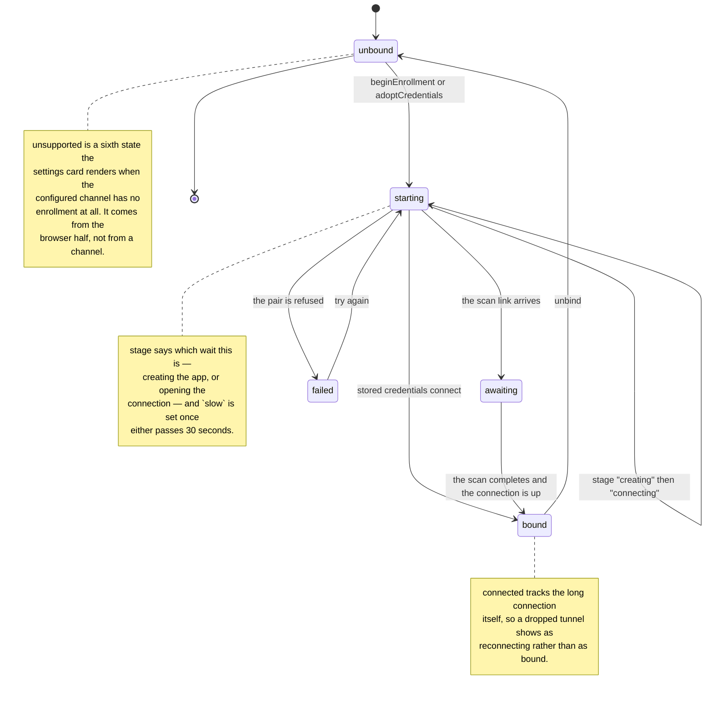

# Configuration

[← All documentation](README.md)

Every value has a default, so the plugin works with no configuration at all. This
page is the reference for a deployment that wants to change one.

## Overriding a value

Settings live in your own profile layer. A patch **replaces the row's entire
`config`**, so restate every key you want to keep:

`$DSH_HOME/profiles/web/cordis.patch.yml`

```yaml
- id: pocket-console
  config:
    channel: dsh-pocket-console/providers/feishu.js
    channelConfig:
      domain: feishu          # or lark
      appName: DSH Pocket Console
      # receiveId: 'ou_xxx'   # optional: skip the scan and name a recipient
    delaySeconds: 120         # desktop head start; 0 = both sides live at once
    titlePrefix: DSH
    resultNotify: idle        # idle (default) or off
    resultNotifyCooldownSeconds: 0
    mirrorTtlSeconds: 60
    locale: zh
```

The example above shows every key at the value the code already ships, so copying it
changes nothing. `npm run check:parity` holds this example, both config pages, the plugin
schema, the Settings card, and the bundle patch to the same set of names **and** the
same defaults, because a documented default that disagrees with the code is read as a
promise.

## Settings you can change at runtime

Three settings are the **settings namespace**: they are editable from the Settings
card (Settings → Plugins → Plugin configuration → "Pocket console"), marked ★ in the
table below, and take effect on the next decision with no restart.

## The states the card can report

Binding is a small machine, and the card names exactly one of its states at a time.
Knowing the shape is what tells you whether a stuck card is waiting for you or working:



## Every setting

| Field | Default | Meaning |
|---|---|---|
| `channel` | `dsh-pocket-console/providers/feishu.js` | Transport module |
| `channelConfig` | `{}` | Transport-owned settings |
| `delaySeconds` | `120` | ★ How long the desktop GUI answers alone |
| `titlePrefix` | `DSH` | ★ Card title prefix |
| `resultNotify` | `idle` | ★ `idle` sends each stopped session's result to the phone; `off` leaves the channel to live requests |
| `resultNotifyCooldownSeconds` | `0` | Shortest gap between two result notices for one session |
| `mirrorTtlSeconds` | `60` | How long a phone decision may still close the desktop composer |
| `locale` | `zh` | Language of the cards sent to the phone (`zh` or `en`) |
| `debug` | `off` | ★ `on` writes the plugin's decision about every card to the deployment log — why it was sent, edited, or skipped |

`debug` is the switch to reach for when a card does something you cannot explain.
A card that is **not** rewritten and a card whose rewrite **failed** look identical on the
phone, and the branch that skips the rewrite is silent by design, so without this the only
symptom is "nothing changed". With it on, each decision is named.

It is deliberately two switches rather than one: this one controls what the **plugin** says,
and the deployment's logger level controls what reaches your terminal —
`<plugin> debug: on` plus a logger running at `debug`. A plugin that could make a
deployment's log louder than the deployment asked for would be a plugin deciding how much
noise its host emits.

The rest are deployment-level: they exist so a deployment can retune the core, and a
person never has to read about them.

`delaySeconds` is the one worth thinking about: it is the desktop's head start, and
`0` makes both sides live at once. A deployment that is only ever attended from the
phone wants `0`; a deployment watched at the desk wants a generous window, because a
card that arrives while you are looking at the dialog it describes is noise.

`mirrorTtlSeconds` is how long a phone answer stays on offer for the browser half to
apply to the desktop composer — long enough to cover a page that is already open,
short enough that a reloaded page never replays an old answer.

The phone card follows the interface language through `messages.js`; `locale` is the
fallback for a deployment that never opens the Web UI.

## Transport settings

`channelConfig` is passed through to the channel untouched, and each channel owns and
validates its own set. These are the Feishu channel's:

| Field | Default | Meaning |
|---|---|---|
| `appIdRef` | `DSH_FEISHU_APP_ID` | Credential reference name |
| `appSecretRef` | `DSH_FEISHU_APP_SECRET` | Credential reference name |
| `domain` | `feishu` | `feishu` or `lark` |
| `receiveId` | — | Name a recipient to skip the scan |
| `receiveIdType` | `open_id` | `open_id` / `chat_id` / `user_id` / `email` |
| `appName` / `appDesc` | see source | Prefilled app identity on the confirmation page |
| `createOnly` | `true` | Keep the one-click flow to creating a new app; an existing one is bound with its own credentials |

Writing a different transport is covered in
[providers/README.md](../providers/README.md); the README's *Writing another channel*
section links it from the top level.
